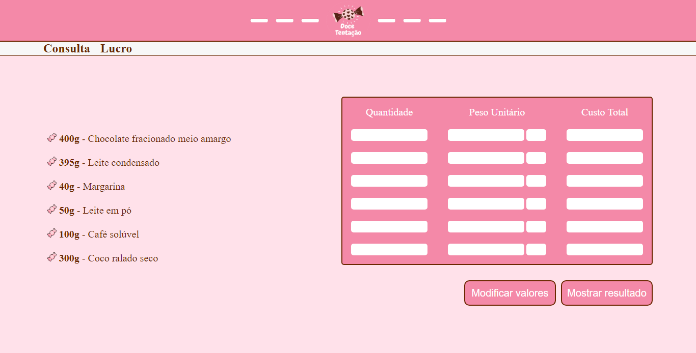

<h1 align="center">  Doce Tentação </h1>

Projeto feito para um trabalho da faculdade que consiste em criar uma calculadora de lucro de acordo com os ingredientes que você tem, onde no final, aparece quantas bandejas poderão ser feitas dentro de R$60 reais cada. 

  <a href="#-tecnologias">Tecnologias</a>&nbsp;&nbsp;&nbsp;|&nbsp;&nbsp;&nbsp;
  <a href="#-projeto">Projeto</a>&nbsp;&nbsp;&nbsp;|&nbsp;&nbsp;&nbsp;
  <a href="#-layout">Layout</a>

 

  

## 🎓 Tecnologias

Esse projeto foi desenvolvido com as seguintes tecnologias:

- HTML e CSS
- JavaScript
- Git e Github

## 📔 Projeto

Calculadora de lucro de doces para empreendedores.
Obs: Não responsivo. Resolução: 1366 x 768.

- [Visite o projeto online](https://isaluh.github.io/doceTentacao/consulta.html)

## 💌 Proposta

Muitas pessoas começaram a preparar bombons de chocolates para complementar a renda.
No nosso caso o chamado Cone Trufado.
Começar a pôr a mão na massa não vai te exigir nem tanto investimento nem muito
sacrifício. Muitas receitas de bombons não gastam mais do que R$ 60 para fazer uma bandeja de mais de 50 peças!
E essa é uma das maiores vantagens em começar a vender bombom ou doces gourmet.
Inclusive, com a onda fitness, você pode até mesmo apostar em bombons para a geração saúde!
Para provar isso, reuni três de receitas de bombons. Escolha a sua preferida, anote todos
os ingredientes e comece a fazer agora mesmo!
Receita de Bombom de leite ninho

**Ingredientes (Receita de Bombom de leite ninho):**

400g de chocolate fracionado meio amargo 
395g leite condensado 
40 g de margarina 
50g de leite em pó 

**Ingredientes (Receita de Bombom de coco (beijinho)):**

400g de chocolate fracionado meio amargo 
395g de leite condensado 
40 g de margarina 
300g de coco ralado seco 

**Ingredientes (Receita de Bombom de café):**

400g de chocolate fracionado meio amargo 
395g leite condensado 
40 g de margarina 
100g de café solúvel 

- **DESAFIO:**

Desenvolver um software que ao digitar os valores dos ingredientes com suas respectivas medidas
da embalagem, devolva para o usuário qual/quais receita(s) ele poderá fazer dentro do limite de
gasto proposto na contextualização.

---

Desenvolver um software, onde:
1. Resolva a situação problema proposta com as três receitas. Os dados podem ser fictícios
(valores e medidas) ou não. O software deverá ser escrito em java (preferencialmente) ou
python, para o back-end. Poderá ter tela, a tela pode ser criada com a linguagem que
souber, mas essa deverá conectar com a linguagem utilizada no back-end.
2. Tenha a opção de aumentar/diminuir a receita. Ao fazer esse aumento o valor mínimo da
receita deverá ser alterado proporcionalmente para ser comparado, ou seja, para que o
software possa dizer se continua dentro do limite de gasto.
3. Calcule automaticamente o valor de custo (preço de custo) de cada cone trufado;
4. Calcule quanto o usuário irá ter de lucro, dado um valor de venda.

---

<h4 align="center">By: Isaluh - feat: Meu Grupo 🤍</h4>